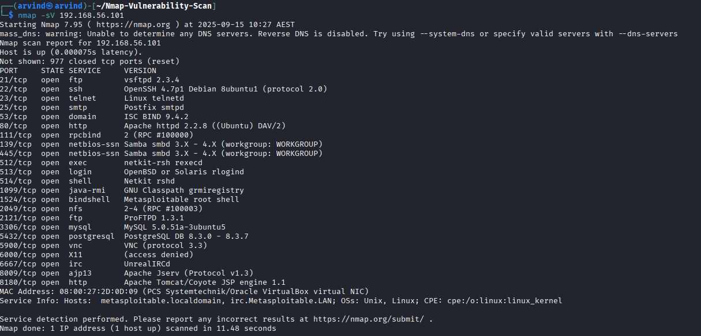

# Metasploitable Nmap Analysis Report

---

## Summary
- **Goal:** Identify open ports, running services, and potential vulnerabilities on the Metasploitable2 VM.  
- **Target:** Metasploitable2 VM  
- **Attacker:** Kali Linux VM  
- **Network:** Host-Only  
- **Attacker IP:** 192.168.56.102  
- **Target IP:** 192.168.56.101  

---

## Methodology
1. Verified network connectivity using `ping`.  
2. Conducted basic Nmap scans:  
   - Ping scan: `nmap -sn 192.168.56.101`  
   - Top 100 TCP ports: `nmap 192.168.56.101`  
3. Ran service version detection: `nmap -sV 192.168.56.101`  
4. Performed aggressive scan with OS detection: `nmap -A 192.168.56.101 -oA outputs/nmap_results`  
5. Vulnerability scripts: `nmap --script vuln 192.168.56.101`  
6. Captured network traffic in Wireshark during scans.  

---

## Observations

### Host Status
- Target is **up** and responding to pings.  
- Total number of open ports: `[fill in after scan]`  
- OS detection: Linux (Ubuntu/Debian-like, per Nmap guess)  

### Open Ports and Services

| Port | Service | Version |
|------|---------|---------|
| 21   | FTP     | vsftpd 2.3.4 |
| 22   | SSH     | OpenSSH 4.7p1 |
| 23   | Telnet  | [version] |
| 25   | SMTP    | Postfix |
| 80   | HTTP    | Apache 2.2.8 |
| 139  | NetBIOS | Samba smbd 3.X |
| 445  | SMB     | Samba smbd 3.X |
| 3306 | MySQL   | 5.0.51a |
| 5432 | PostgreSQL | 8.3.0 |
| 5900 | VNC     | [version] |
| 6000 | X11     | [version] |

### Observed Vulnerabilities
- **FTP:** Anonymous login enabled  
- **SSH:** Weak version with known vulnerabilities  
- **Telnet:** Unencrypted credentials  
- **HTTP:** Default pages, possible outdated modules  
- **MySQL/PostgreSQL:** Default credentials may allow remote login  
- **Samba:** Version 3.X vulnerable to multiple exploits   

---

## Screenshots

- **Ping Scan**  
    

- **Nmap Service Version Scan**  
    

- **Nmap Aggressive Scan**  
    

- **Wireshark Capture**  
    

---

## Conclusion
This lab demonstrates:  
- Effective network scanning to identify live hosts and open ports.  
- Service enumeration and version detection using Nmap.  
- Identification of potential vulnerabilities and security misconfigurations.  

---

