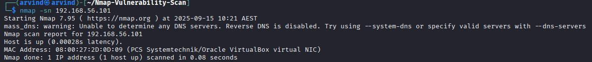
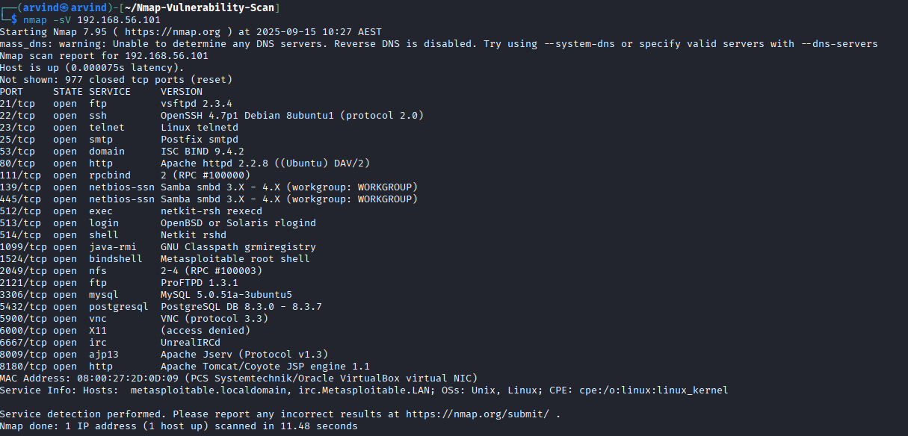
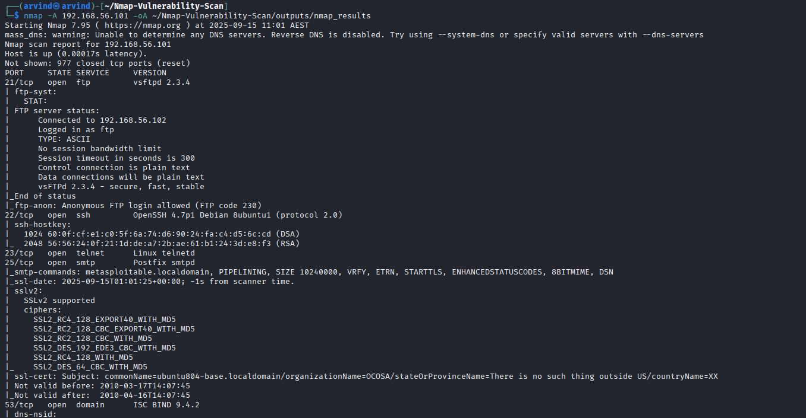
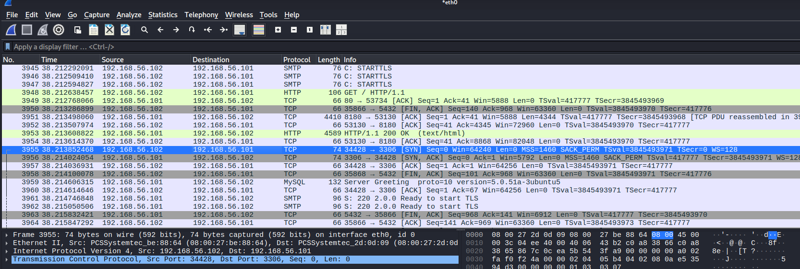

# Metasploitable Nmap Vulnerability Scan

## Project Overview
This project demonstrates network scanning and service enumeration on a vulnerable VM (Metasploitable2) from a Kali Linux attacker machine. The goal is to identify open ports, running services, and potential vulnerabilities.

## Environment
- **Attacker VM:** Kali Linux
- **Target VM:** Metasploitable2
- **Network:** Host-Only
- **Attacker IP:** 192.168.56.102
- **Target IP:** 192.168.56.101

## Tools
- Nmap
- Wireshark

## Steps
1. Verified network connectivity using `ping`.
2. Conducted basic ping and port scans.
3. Ran service version detection using `nmap -sV`.
4. Performed aggressive scan using `nmap -A`.
5. Optionally, ran vulnerability scripts using `nmap --script vuln`.
6. Captured network traffic in Wireshark (optional).

## Findings
### Open Ports: 
- 21/tcp  → FTP (vsftpd 2.3.4)
- 22/tcp  → SSH (OpenSSH 4.7p1)
- 23/tcp  → Telnet
- 25/tcp  → SMTP (Postfix)
- 80/tcp  → HTTP (Apache 2.2.8)
- 139/tcp → NetBIOS
- 445/tcp → Microsoft-DS (Samba)
- 3306/tcp → MySQL
- 5432/tcp → PostgreSQL
- 5900/tcp → VNC
- 6000/tcp → X11
  

  ### Services and Versions:
| Port | Service | Version |
|------|---------|---------|
| 21   | FTP     | vsftpd 2.3.4 |
| 22   | SSH     | OpenSSH 4.7p1 |
| 23   | Telnet  | Linux Telnetd |
| 25   | SMTP    | Postfix |
| 80   | HTTP    | Apache 2.2.8 |
| 139  | NetBIOS | Samba smbd 3.X |
| 445  | SMB     | Samba smbd 3.X |
| 3306 | MySQL   | 5.0.51a |
| 5432 | PostgreSQL | 8.3.0 |
| 5900 | VNC     | VNC Protocol 3.3 |
| 6000 | X11     | Acess denied |

### Observed Vulnerabilities:
- FTP: Anonymous login enabled → allows unauthenticated access  
- SSH: Weak version, known vulnerabilities  
- Telnet: Unencrypted credentials  
- HTTP: Default Apache pages, possible outdated modules  
- MySQL/PostgreSQL: Default credentials may allow remote login  
- Samba: Version 3.X vulnerable to multiple exploits  

## Screenshots
Here are some key outputs from the scans and captures:

- **Ping Scan:**  
  

- **Nmap Service Version Scan:**  
  

- **Nmap Aggressive Scan:**  
  

- **Wireshark Capture (Optional):**  
  

